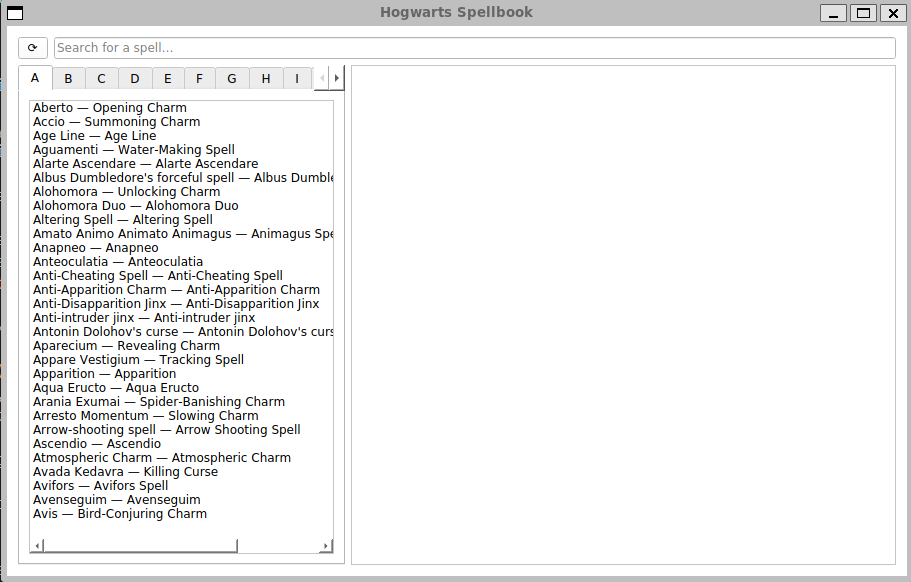
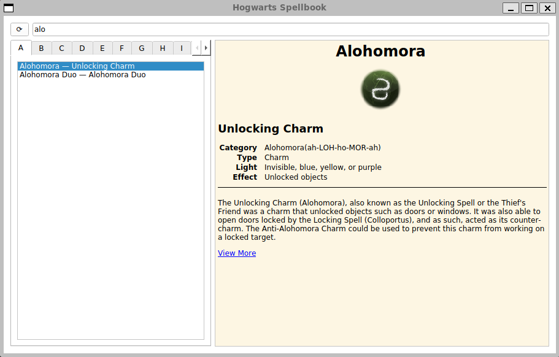

# Alohamora: Unlock all of the spells from the Harry Potter Universe! (*alohamora*)

> *GUI Based application that can be used to peruse all of the known spells.*

![Python version][python-version]
![Latest version][latest-version]
[![GitHub issues][issues-image]][issues-url]
[![GitHub forks][fork-image]][fork-url]
[![GitHub Stars][stars-image]][stars-url]
[![License][license-image]][license-url]

NOTE: This project was generated with [Cookiecutter](https://github.com/audreyr/cookiecutter) along with [@clamytoe's](https://github.com/clamytoe) [toepack](https://github.com/clamytoe/toepack) project template.

## Initial setup

```zsh
cd Projects
git clone https://github.com/clamytoe/alohamora.git
cd alohamora
```

### Anaconda setup

If you are an Anaconda user, this command will get you up to speed with the base installation.

```zsh
conda env create
conda activate alohamora
```

### Regular Python setup

If you are just using normal Python, this will get you ready, but I highly recommend that you do this in a virtual environment.
There are many ways to do this, the simplest using *venv*.

```zsh
python3 -m venv venv
source venv/bin/activate
pip install -r requirements.txt
```

## Usage

```zsh
python get_spells.py
python spellbook_gui.py
```



Selecting a spell will display its summary.



Clicking on the "View More" link will open the spell page in your default browser.


## Contributing

Contributions are welcomed.
Tests can be run with with `pytest -v`, please ensure that all tests are passing and that you've checked your code with the following packages before submitting a pull request:

* black
* flake8
* isort
* mypy
* pytest-cov

I am not adhering to them strictly, but try to clean up what's reasonable.

## License

Distributed under the terms of the [MIT](https://opensource.org/licenses/MIT) license, "alohamora" is free and open source software.

## Issues

If you encounter any problems, please [file an issue](https://github.com/clamytoe/toepack/issues) along with a detailed description.

## Changelog

* **v0.1.0** Initial commit.

[python-version]:https://img.shields.io/badge/python-3.13.3-brightgreen.svg
[latest-version]:https://img.shields.io/badge/version-0.1.0-blue.svg
[issues-image]:https://img.shields.io/github/issues/clamytoe/alohamora.svg
[issues-url]:https://github.com/clamytoe/alohamora/issues
[fork-image]:https://img.shields.io/github/forks/clamytoe/alohamora.svg
[fork-url]:https://github.com/clamytoe/alohamora/network
[stars-image]:https://img.shields.io/github/stars/clamytoe/alohamora.svg
[stars-url]:https://github.com/clamytoe/alohamora/stargazers
[license-image]:https://img.shields.io/github/license/clamytoe/alohamora.svg
[license-url]:https://github.com/clamytoe/alohamora/blob/main/LICENSE
